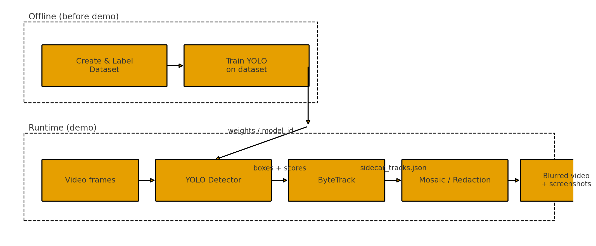
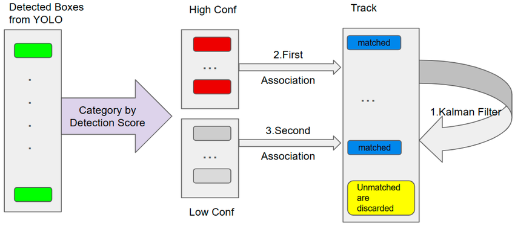

# 2025_hackathon
video masking

## Methodology



Why YOLO? 
It’s a fast, one-stage detector with a mature ecosystem and easy deployment. It works well for near-real-time demos and can be swapped between hosted and self-trained weights


What is ByteTrack? 
A lightweight tracking-by-detection method. It first matches high-confidence detections, then uses low-confidence ones to fill short gaps, so IDs stay consistent even if some frames miss detections. No extra training is needed


## Detection Model

### First:  ultralytics pretrained car plate detection model 

https://github.com/ultralytics/notebooks/blob/main/notebooks/how-to-use-ultralytics-yolo-with-openai-for-number-plate-recognition.ipynb

=> Poor perform on other videos

### Second:  pretrained model on roboflow universe , calling their Hosted API

https://universe.roboflow.com/roboflow-universe-projects/license-plate-recognition-rxg4e

=> Looks good 

### Third: Self-trained Multi-class yolo model

1. No Dataset? Try Open-Vocabulary Detection - OWL-ViT (Open World Learning Vision Transformer) , not good....
2. Download a few dataset in yolo11 format from roboflow-universe-projects
```
RAW_DATASETS = [
    Path("/home/ec2-user/self_train_yolo11/fire_arm_detection.v1i.yolov11"),
    Path("/home/ec2-user/self_train_yolo11/License_Plate_Recognition.v11i.yolov11"),
    Path("/home/ec2-user/self_train_yolo11/weapon_detection.v10i.yolov11"),
    Path("/home/ec2-user/self_train_yolo11/e_commerce_gun_detection.v5i.yolov11"),
]
```
3. Define mapping rules per dataset
```
FINAL_CLASSES = ["license_plate", "weapon"]

#  Define mapping rules per dataset
PER_DATASET_CLASS_MAP = {
    "/home/ec2-user/self_train_yolo11/fire_arm_detection.v1i.yolov11": {
        "we - v2 2024-10-09 10-14am": "weapon",
    },
    "/home/ec2-user/self_train_yolo11/License_Plate_Recognition.v11i.yolov11": {
        "License_Plate": "license_plate"
    },
    "/home/ec2-user/self_train_yolo11/weapon_detection.v10i.yolov11": {
        "gun": "weapon",
        "knife": "weapon",
        # everything else ignored
        "arm": None,
        "body": None,
        "face": None,
        "foot": None,
        "hand": None,
        "human": None,
        "leg": None,
        "object": None,
        "person": None,
    }, 
    "/home/ec2-user/self_train_yolo11/e_commerce_gun_detection.v5i.yolov11": {
        "weapon": "weapon"
    },
}
```
4. yolo training 12hr......
```
from ultralytics import YOLO

model = YOLO("yolo11n.pt")  # smaller than m; try yolo11s.pt if you can
results = model.train(
    data="/home/ec2-user/self_train_yolo11/data.yaml",
    imgsz=960,      # down from 1280; try 960 or 896 if needed
    batch=-1,        # auto-find the largest batch that fits in VRAM
    epochs=80,
    cos_lr=True,
    workers=2,       # smaller dataloader footprint
    amp=True,        # mixed precision (default True; keep it)
    cache=None,      # make sure we don't cache dataset in RAM/GPU
)
```
=> Overall good, still need fine-tuning and try on more videos
